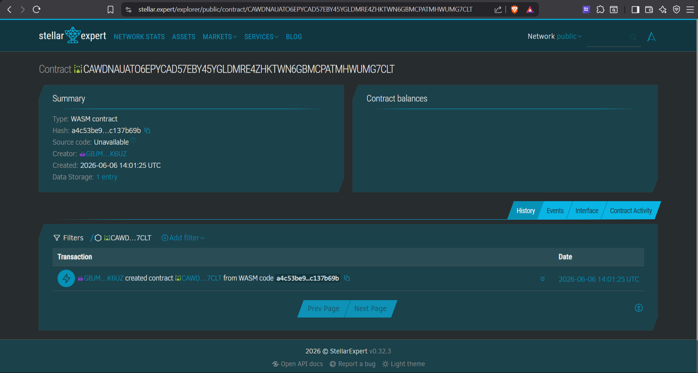
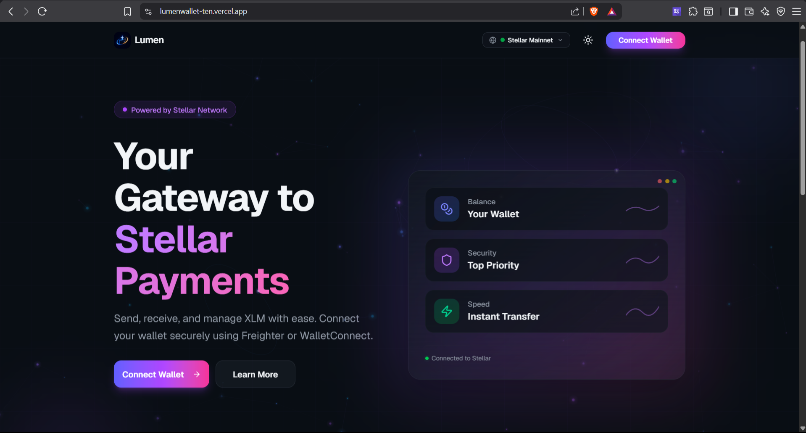

# ✨ Lumen Wallet — Stellar Blockchain Wallet & DEX


> **Live Demo**: [https://lumenwallet-ten.vercel.app](https://lumenwallet-ten.vercel.app)

Lumen Wallet is a **full-featured, modern web-based wallet** for the Stellar blockchain network. It supports native XLM payments, Soroban smart contract token management, built-in DEX swap trading via Stellar Path Payments, multi-signature account management, and seamless network switching between Testnet and Mainnet — all wrapped in a sleek, glassmorphic UI.

---

## 🚀 Features

### 💰 Wallet Management
- **Multi-wallet support**: Connect via Freighter browser extension, WalletConnect, or manual Secret Key import
- **Real-time balance tracking**: Live XLM balance with auto-refresh using SWR
- **Transaction history**: View all payments, received funds, and account creation events
- **QR Code receive**: Generate QR codes for easy receiving
- **Testnet faucet**: One-click funding via Stellar Friendbot (testnet only)

### 🔄 DEX Swap Trading (Stellar Path Payments)
- **Instant token swaps**: Swap XLM ↔ USDC, EURC, and custom Soroban tokens
- **Best route detection**: Uses Stellar `strictSendPaths` for optimal exchange rates
- **Adjustable slippage**: Configure slippage tolerance (0.5%, 1%, 2%, 5%)
- **Automatic trustline management**: Detects and creates trustlines before swap execution
- **Real-time price quotes**: Live pathfinding with estimated output amounts

### 🪙 Soroban Smart Contract — Custom Token (SEP-41)
- **SEP-41 compliant**: Full fungible token implementation deployed on Soroban
- **Admin-controlled minting**: Mint new tokens with admin authorization
- **Token transfers**: Transfer custom tokens between any Stellar accounts
- **On-chain metadata**: Token name, symbol, and decimals stored on-chain
- **Stellar Asset Contract (SAC)**: Wraps classic Stellar assets as Soroban-compatible contracts

### 🔐 Multi-Signature (Multisig)
- **Multi-signer management**: Add/remove signers with configurable weights
- **Threshold configuration**: Set low, medium, and high operation thresholds
- **Proposal system**: Create, approve, and execute multisig transaction proposals

### 🌐 Network Switching
- **Dual-network support**: Seamless switching between Stellar Testnet and Mainnet
- **Persistent preference**: Network choice saved in localStorage
- **Visual indicator**: Clear network badge in the UI header

---

## 📜 Smart Contract

### Mainnet Smart Contract ID

```
CAWDNAUATO6EPYCAD57EBY45YGLDMRE4ZHKTWN6GBMCPATMHWUMG7CLT
```



| Detail | Value |
|--------|-------|
| **Token Name** | Lumen Token |
| **Token Symbol** | LMT |
| **Decimals** | 7 |
| **Network** | Stellar Mainnet |
| **Type** | Custom Soroban Token — SEP-41 |
| **Explorer** | [View on Stellar Expert](https://stellar.expert/explorer/public/contract/CAWDNAUATO6EPYCAD57EBY45YGLDMRE4ZHKTWN6GBMCPATMHWUMG7CLT) |

### Contract Interface

| Method | Auth | Description |
|--------|------|-------------|
| `initialize(admin, decimal, name, symbol)` | — | One-time token setup |
| `mint(to, amount)` | admin | Create new tokens |
| `transfer(from, to, amount)` | from | Move tokens between accounts |
| `balance(id)` | — | Read account balance |
| `approve(from, spender, amount, expiration)` | from | Set spending allowance |
| `allowance(from, spender)` | — | Read allowance |
| `transfer_from(spender, from, to, amount)` | spender | Spend via allowance |
| `burn(from, amount)` | from | Destroy tokens |
| `burn_from(spender, from, amount)` | spender | Burn via allowance |
| `set_admin(new_admin)` | admin | Transfer admin rights |
| `decimals()` / `name()` / `symbol()` | — | Read token metadata |

> **Note**: Amounts are integers in base units. A balance of `1000000000` on a token with `decimal = 7` represents `100.0` tokens. The wallet UI handles this conversion automatically.

---

## 🛠️ Tech Stack



| Category | Technology |
|----------|-----------|
| **Framework** | Next.js 16 (App Router, Server Components) |
| **Language** | TypeScript 5.7 |
| **Styling** | Tailwind CSS 4 + Custom Design Tokens |
| **UI Library** | shadcn/ui + Radix UI Primitives |
| **Stellar SDK** | @stellar/stellar-sdk 15.1.0 |
| **Wallet Integration** | @stellar/freighter-api 6.0.1 |
| **Smart Contract** | Soroban (Rust → WASM) / SAC |
| **Data Fetching** | SWR 2.4 |
| **Deployment** | Vercel |

---

## 📦 Getting Started

### Prerequisites
- Node.js >= 20
- pnpm (recommended) or npm

### Installation

```bash
# Clone the repository
git clone https://github.com/MuhamadHamzah/lumen-wallet.git
cd lumen-wallet

# Install dependencies
pnpm install

# Start development server
pnpm dev
```

Open [http://localhost:3000](http://localhost:3000) in your browser.

### Environment Variables

Create a `.env` file in the root directory:

```env
NEXT_PUBLIC_STELLAR_NETWORK=testnet
STELLAR_NETWORK=testnet
```

| Variable | Default | Description |
|----------|---------|-------------|
| `NEXT_PUBLIC_STELLAR_NETWORK` | `testnet` | Default network for client-side |
| `STELLAR_NETWORK` | `testnet` | Default network for server-side API routes |

> Users can switch between testnet and mainnet at runtime via the Network Switcher in the UI.

---

## 🏗️ Project Structure

```
lumen-wallet/
├── app/                          # Next.js App Router pages
│   ├── page.tsx                  # Landing / Dashboard
│   ├── send/                     # Send XLM page
│   ├── receive/                  # Receive with QR code
│   ├── history/                  # Transaction history
│   ├── swap/                     # DEX Swap trading page
│   ├── tokens/                   # Custom token management
│   ├── multisig/                 # Multi-signature management
│   └── api/                      # Server-side API routes
│       ├── account/              # Account details
│       ├── balance/              # Balance queries
│       ├── send/                 # Payment submission
│       ├── swap/                 # Swap execution & pathfinding
│       ├── trustline/            # Trustline management
│       ├── token/                # Token info, mint, transfer
│       ├── transactions/         # Transaction history
│       └── multisig/             # Multisig proposals
├── components/                   # React UI components
│   ├── app-shell.tsx             # Main layout (sidebar + mobile nav)
│   ├── wallet-provider.tsx       # Wallet state context
│   ├── network-switcher.tsx      # Testnet/Mainnet toggle
│   ├── wallet-connection.tsx     # Wallet connection UI
│   ├── landing/                  # Landing page sections
│   ├── dashboard/                # Dashboard widgets
│   ├── tokens/                   # Token management UI
│   └── multisig/                 # Multisig UI
├── lib/                          # Shared libraries
│   ├── stellar.ts                # Client-side Stellar helpers
│   ├── stellar-server.ts         # Server-side Stellar SDK
│   ├── soroban.ts                # Client-side Soroban helpers
│   └── soroban-server.ts         # Server-side Soroban SDK
├── contracts/                    # Soroban smart contracts (Rust)
│   └── custom-token/             # SEP-41 custom fungible token
│       ├── Cargo.toml
│       └── src/
│           ├── lib.rs
│           ├── contract.rs       # Token logic
│           ├── storage.rs        # On-chain storage
│           └── test.rs           # Unit tests
├── scripts/
│   └── deploy-token.mjs          # Automated contract deployment
└── styles/                       # Global CSS
```

---

## 🔒 Security

- **Server-side key handling**: Secret keys are only processed in API routes (`server-only`), never shipped to the client bundle
- **Freighter integration**: When using Freighter, private keys never leave the browser extension
- **No key persistence**: Secret keys stored in React state (RAM only), cleared on disconnect
- **Input validation**: All keys validated using `StrKey` before use
- **Error handling**: Stellar error codes translated to human-readable messages

---

## 🌍 Deployment

The application is deployed on **Vercel** with automatic deployments on push to `main`.

```bash
# Manual production deploy
npx vercel --prod
```

**Live URL**: [https://lumenwallet-ten.vercel.app](https://lumenwallet-ten.vercel.app)

---

## 📄 License

This project is licensed under the MIT License.

---

## 👨‍💻 Author

**Muhamad Hamzah**
GitHub: [@MuhamadHamzah](https://github.com/MuhamadHamzah)

---

## 🙏 Acknowledgments

- [Stellar Development Foundation](https://stellar.org/) — Blockchain infrastructure
- [Soroban](https://soroban.stellar.org/) — Smart contract platform
- [shadcn/ui](https://ui.shadcn.com/) — UI component library
- [Vercel](https://vercel.com/) — Deployment platform
