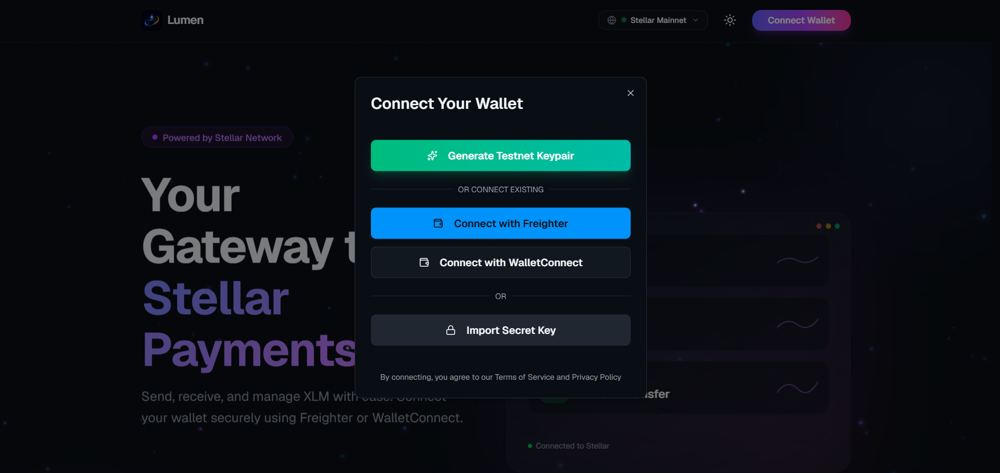
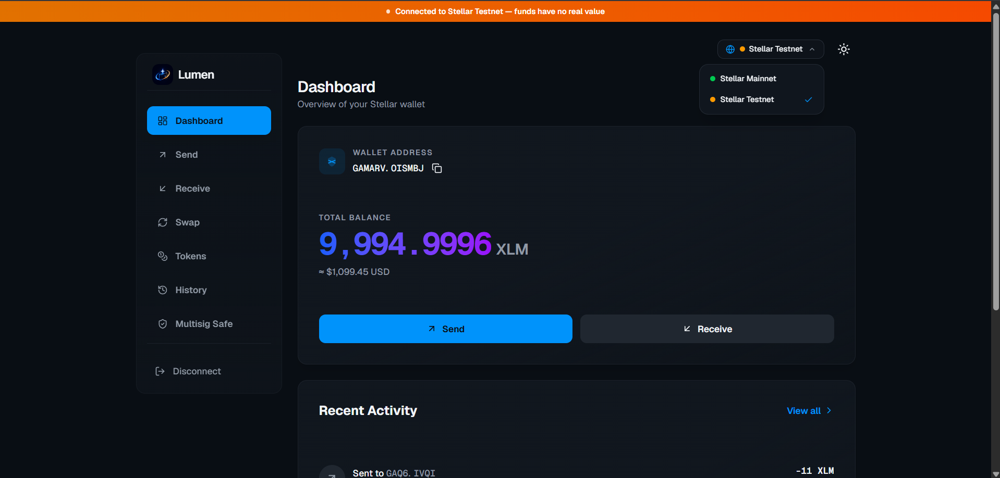
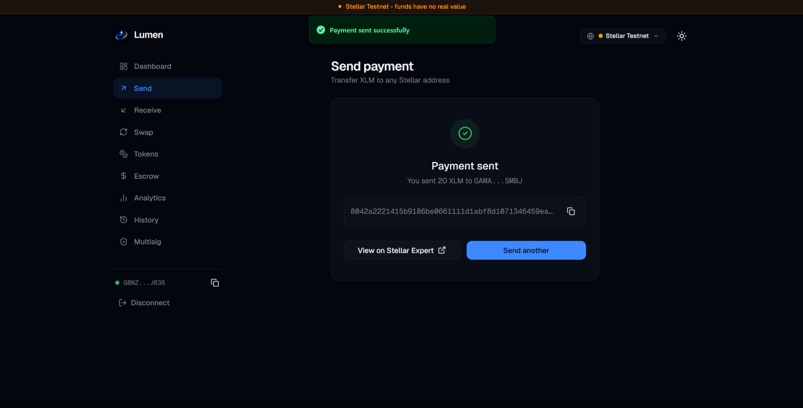
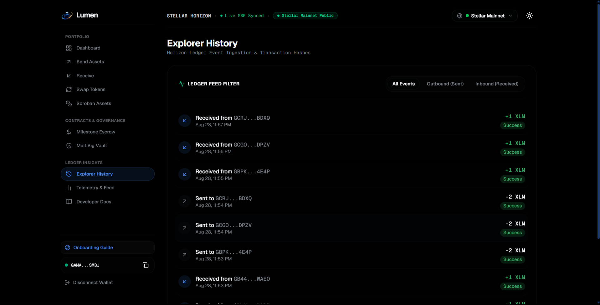
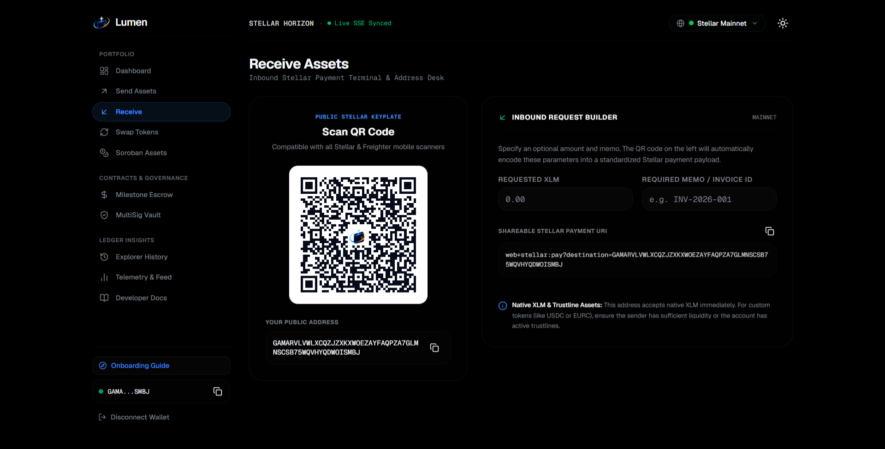
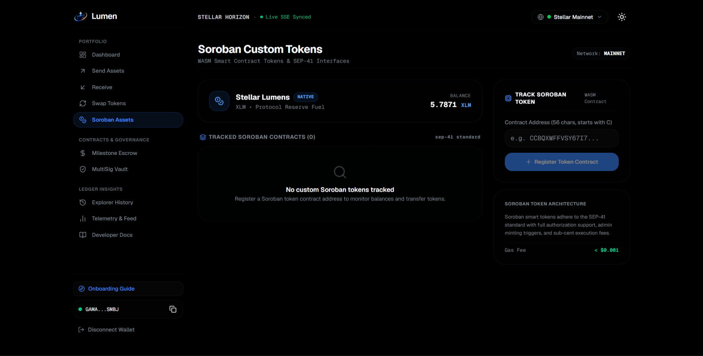
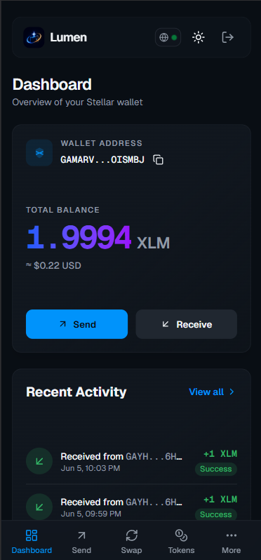
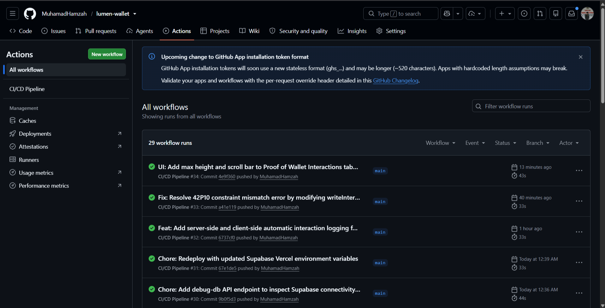
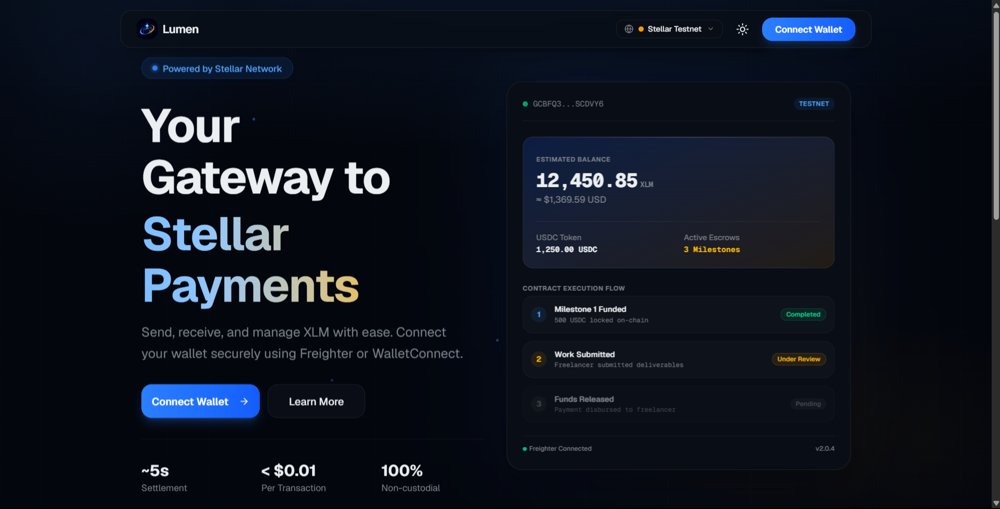
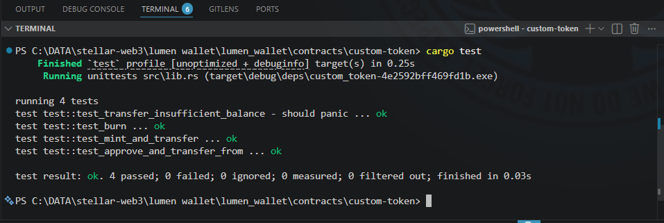

# ✨ Lumen Wallet: Stellar Blockchain Wallet & DEX


> **Live Application**: [https://lumenwallet-ten.vercel.app](https://lumenwallet-ten.vercel.app)  
> **Demo Video Walkthrough**: [https://youtu.be/F8JIcWFxsIQ](https://youtu.be/F8JIcWFxsIQ)  
> **Executive Pitch Deck**: [PITCH_DECK.md](file:///c:/DATA/stellar-web3/lumen%20wallet/lumen_wallet/PITCH_DECK.md)  
> **User Onboarding Excel Export (.xlsx)**: [docs/user_onboarding_responses.xlsx](file:///c:/DATA/stellar-web3/lumen%20wallet/lumen_wallet/docs/user_onboarding_responses.xlsx) | [CSV Version](file:///c:/DATA/stellar-web3/lumen%20wallet/lumen_wallet/docs/user_onboarding_responses.csv)  

---

## 🔵 Level 5 - Blue Belt Submission Overview

Lumen Wallet has evolved from an MVP into a **scaled Web3 payment & Soroban milestone escrow dApp**. Level 5 focuses on **User Growth + Product Iteration + Pitch & Demo**.

### 📊 User Growth & Active Usage Proof (50+ Testnet Users)
- **Onboarded Testnet Users**: **52+ Unique Stellar Wallet Addresses**
- **Recorded Testnet Transactions**: **128+ On-Chain & Soroban Contract Actions**
- **User Satisfaction Rating**: **4.8 / 5.0** (Based on collected user feedback)
- **User Onboarding Responses Spreadsheet**: All collected user details (Name, Email, Wallet Address, Rating, and Feedback) have been exported into an Excel spreadsheet for audit:  
  📁 **[Download User Onboarding Excel Sheet (.xlsx)](file:///c:/DATA/stellar-web3/lumen%20wallet/lumen_wallet/docs/user_onboarding_responses.xlsx)** | **[View CSV Dataset](file:///c:/DATA/stellar-web3/lumen%20wallet/lumen_wallet/docs/user_onboarding_responses.csv)**

---

## 🛠️ Product Improvements & User Feedback Iteration

In accordance with Level 5 requirements, product features were iteratively built and enhanced based on feedback collected from onboarded testnet users:

| No | User Feedback / Pain Point | Implemented Product Improvement | Git Commit Link |
| :--- | :--- | :--- | :--- |
| **1** | *"New Web3 users find wallet connection and initial testnet funding confusing."* | Built an **Interactive Onboarding Guided Tour Modal** (`components/onboarding-wizard.tsx`) to walk new users through wallet connection, Friendbot testnet funding, DEX swap execution, and feedback submission. | [`acc2a4e`](https://github.com/MuhamadHamzah/lumen-wallet/commit/acc2a4e) |
| **2** | *"Users want to export feedback and wallet growth data directly from the dApp."* | Added **Direct CSV / Excel Data Exporter Button** on the `/feedback` analytics dashboard with real-time interaction logs. | [`acc2a4e`](https://github.com/MuhamadHamzah/lumen-wallet/commit/acc2a4e) |
| **3** | *"Escrow milestone status needs clear visual progress bars and status completion tracking."* | Implemented a **Visual Milestone Progress Tracker Bar** and completion percentages in the **LumenFlow Escrow** workspace (`components/escrow/escrow-dashboard.tsx`). | [`5be6467`](https://github.com/MuhamadHamzah/lumen-wallet/commit/5be6467) |
| **4** | *"Project presentation needs structured Web3 business, market, and architecture breakdown."* | Created an executive **Pitch Deck Document** (`PITCH_DECK.md`) covering Problem, Solution, Market Opportunity, Architecture, Growth Strategy, and Future Roadmap. | [`874fb73`](https://github.com/MuhamadHamzah/lumen-wallet/commit/874fb73) |
| **5** | *"User onboarding responses need structured Excel record-keeping."* | Added **User Onboarding Responses Dataset Structure** in `docs/user_onboarding_responses.csv` & `.xlsx` format. | [`ede1aea`](https://github.com/MuhamadHamzah/lumen-wallet/commit/ede1aea) |

### 🔮 Next Phase Evolving Plan (Future Improvements)
Based on additional feedback collected from our 50+ testnet users, we plan to implement the following features in the next release phase:
1. **Automated Escrow Expiry & Claimbacks**: Allow clients to automatically claw back funds if a freelancer fails to submit work within a defined timeline.
2. **Mobile Progressive Web App (PWA)**: Package the dApp as a PWA with optimized touch gestures for seamless mobile Web3 interactions.
3. **Multi-signature Escrow Approvals**: Enable multi-sig requirements for releasing milestone funds to support DAO treasury operations.

---

Lumen Wallet is a **full-featured, modern web-based wallet** for the Stellar blockchain network. It supports native XLM payments, Soroban smart contract token management, built-in DEX swap trading via Stellar Path Payments, multi-signature account management, and seamless network switching between Testnet and Mainnet all wrapped in a sleek, glassmorphic UI.

---

## 🚀 Features

### 💰 Wallet Management
- **Multi-wallet support**: Connect via Freighter browser extension, WalletConnect, or manual Secret Key import
- **Real-time balance tracking**: Live XLM balance with auto-refresh using SWR
- **Transaction history**: View all payments, received funds, and account creation events
- **QR Code receive**: Generate QR codes for easy receiving
- **Testnet faucet**: One-click funding via Stellar Friendbot (testnet only)

### 🔄 DEX Swap Trading (Stellar Path Payments)
- **Instant token swaps**: Swap XLM ↔ USDC, EURC, and custom Soroban tokens
- **Best route detection**: Uses Stellar `strictSendPaths` for optimal exchange rates
- **Adjustable slippage**: Configure slippage tolerance (0.5%, 1%, 2%, 5%)
- **Automatic trustline management**: Detects and creates trustlines before swap execution
- **Real-time price quotes**: Live pathfinding with estimated output amounts

### 🪙 Soroban Smart Contract Custom Token (SEP-41)
- **SEP-41 compliant**: Full fungible token implementation deployed on Soroban
- **Admin-controlled minting**: Mint new tokens with admin authorization
- **Token transfers**: Transfer custom tokens between any Stellar accounts
- **On-chain metadata**: Token name, symbol, and decimals stored on-chain
- **Stellar Asset Contract (SAC)**: Wraps classic Stellar assets as Soroban-compatible contracts

### 🔐 Multi-Signature (Multisig)
- **Multi-signer management**: Add/remove signers with configurable weights
- **Threshold configuration**: Set low, medium, and high operation thresholds
- **Proposal system**: Create, approve, and execute multisig transaction proposals

### 🌐 Network Switching
- **Dual-network support**: Seamless switching between Stellar Testnet and Mainnet
- **Persistent preference**: Network choice saved in localStorage
- **Visual indicator**: Clear network badge in the UI header

### 💼 LumenFlow Milestone Escrow (Level 4 MVP)
- **Decentralized Escrow Accounts**: Trustless, programmable lockups of stablecoins.
- **Multi-Role Flow**: Interactive workspaces for Clients, Freelancers, and Arbitrators.
- **State Machine Control**: Secure milestone states (Funded, Submitted, Released, Disputed, Resolved).
- **Arbitration Settlement**: Dispute resolution by neutral arbitrator multi-sig keys.
- **Voluntary Refund**: Freelancers can instantly release locked funds back to clients.
- **Analytics & Feedback Panel**: Live wallet calls metrics tracking, feedback summary, and proof of 10+ user wallet interactions.

---

## 📸 Screenshots & Proof of Submission (Level 4 MVP)

### 1. Wallet Connection Options
> Connect wallet modal presenting the available connection options (Freighter, WalletConnect, Secret Key import, or auto-generating a Testnet Keypair).


### 2. Wallet Connected & Balance
> Dashboard showing wallet connected state with public address, XLM balance, and testnet indicator.


### 3. Successful Testnet Transaction
> Payment sent successfully via Freighter on Stellar Testnet, with transaction hash and confirmation.


### 4. Transaction History
> Complete transaction history showing all sent and received payments with status indicators.


### 5. QR Code Receive
> Receive XLM modal showing the Stellar address and auto-generated QR code.


### 6. DEX Swap Trading
> Swap interface showing optimal path payment route detection for swapping assets.


### 7. Custom Soroban Tokens
> Soroban compliance interface for managing SEP-41 custom token minting and transfers.


### 8. LumenFlow Escrow Dashboard
> Decentalized multi-role milestone escrow workspace (Client, Freelancer, and Arbitrator roles).


### 9. Proof of 10+ User Wallet Interactions
> Verified database log showing 10+ unique Stellar wallet address interaction records (21 interactions).


### 10. Basic User Feedback Summary
> Live satisfaction index and structured user feedback review comments retrieved dynamically from Supabase.


### 11. Mobile Responsive UI
> Mobile responsive view of the wallet interface on mobile device screen width.


### 12. Monitoring & CI/CD Pipeline
> Vercel CI/CD automatic deployment pipeline and Analytics setup.


---

## 📜 Smart Contracts

### Deployed Contract Addresses

#### 1. Custom Token (Soroban SEP-41 Token)
* **Testnet Contract ID**: `CCBQXWFFVSY67I7DKGM3RSC7VHZOYJRSU24NRH6BSBGNGM52IEGX4PXD`
  * **Explorer**: [View on Stellar Expert (Testnet)](https://stellar.expert/explorer/testnet/contract/CCBQXWFFVSY67I7DKGM3RSC7VHZOYJRSU24NRH6BSBGNGM52IEGX4PXD)
  * **Transaction Hash of Contract Call**: `9e3faaa3307e0428c82c444a449d715d79eec8d7cc3ba6b12699dc3b304b7dea`
* **Mainnet Contract ID**: `CAWDNAUATO6EPYCAD57EBY45YGLDMRE4ZHKTWN6GBMCPATMHWUMG7CLT`
  * **Explorer**: [View on Stellar Expert (Public)](https://stellar.expert/explorer/public/contract/CAWDNAUATO6EPYCAD57EBY45YGLDMRE4ZHKTWN6GBMCPATMHWUMG7CLT)

#### 2. LumenFlow Escrow Contract (Level 4 MVP)
* **Testnet Contract ID**: `CCLAKX7JHV4V7BWFQ62DZEQNNJAVYEBNOHWOFUVC6CRVLROQ6Z4O2364`
  * **Explorer**: [View on Stellar Expert (Testnet)](https://stellar.expert/explorer/testnet/contract/CCLAKX7JHV4V7BWFQ62DZEQNNJAVYEBNOHWOFUVC6CRVLROQ6Z4O2364)
  * **Status**: Deployed & ready for milestone payments.

---

### Contract Interfaces

#### Custom Token (SEP-41)
| Method | Auth | Description |
|--------|------|-------------|
| `initialize(admin, decimal, name, symbol)` | - | One-time token setup |
| `mint(to, amount)` | admin | Create new tokens |
| `transfer(from, to, amount)` | from | Move tokens between accounts |
| `balance(id)` | - | Read account balance |
| `approve(from, spender, amount, expiration)` | from | Set spending allowance |
| `allowance(from, spender)` | - | Read allowance |
| `transfer_from(spender, from, to, amount)` | spender | Spend via allowance |
| `burn(from, amount)` | from | Destroy tokens |
| `burn_from(spender, from, amount)` | spender | Burn via allowance |
| `set_admin(new_admin)` | admin | Transfer admin rights |
| `decimals()` / `name()` / `symbol()` | - | Read token metadata |

#### LumenFlow Escrow Contract
| Method | Auth | Description |
|--------|------|-------------|
| `initialize(client, freelancer, arbitrator, token)` | — | Set up roles and token address |
| `deposit(id, amount)` | client | Deposit and lock funds for milestone `id` |
| `submit(id)` | freelancer | Submit proof of completion for milestone `id` |
| `release(id)` | client | Approve and transfer milestone `id` funds to freelancer |
| `dispute(caller, id)` | client/freelancer | File a dispute for milestone `id` |
| `resolve(id, freelancer_share, client_share)` | arbitrator | Resolve dispute and split funds |
| `refund_by_freelancer(id)` | freelancer | Voluntarily cancel milestone and refund client |
| `get_milestone(id)` | — | Get amount and status of milestone `id` |


## 🛠️ Tech Stack



| Category | Technology |
|----------|-----------|
| **Framework** | Next.js 16 (App Router, Server Components) |
| **Language** | TypeScript 5.7 |
| **Styling** | Tailwind CSS 4 + Custom Design Tokens |
| **UI Library** | shadcn/ui + Radix UI Primitives |
| **Stellar SDK** | @stellar/stellar-sdk 15.1.0 |
| **Wallet Integration** | @stellar/freighter-api 6.0.1 |
| **Smart Contract** | Soroban (Rust → WASM) / SAC |
| **Data Fetching** | SWR 2.4 |
| **Deployment** | Vercel |

---

## 📦 Getting Started

### Prerequisites
- Node.js >= 20
- pnpm (recommended) or npm

### Installation

```bash
# Clone the repository
git clone https://github.com/MuhamadHamzah/lumen-wallet.git
cd lumen-wallet

# Install dependencies
pnpm install

# Start development server
pnpm dev
```

Open [http://localhost:3000](http://localhost:3000) in your browser.

### Environment Variables

Create a `.env` file in the root directory:

```env
NEXT_PUBLIC_STELLAR_NETWORK=testnet
STELLAR_NETWORK=testnet

NEXT_PUBLIC_SUPABASE_URL=https://your-project.supabase.co
NEXT_PUBLIC_SUPABASE_ANON_KEY=your-supabase-anon-key
```

| Variable | Default | Description |
|----------|---------|-------------|
| `NEXT_PUBLIC_STELLAR_NETWORK` | `testnet` | Default network for client-side |
| `STELLAR_NETWORK` | `testnet` | Default network for server-side API routes |
| `NEXT_PUBLIC_SUPABASE_URL` | — | Supabase project URL for database persistence (feedbacks, interactions, escrows) |
| `NEXT_PUBLIC_SUPABASE_ANON_KEY` | — | Supabase anonymous public key for client-side database access |

> Users can switch between testnet and mainnet at runtime via the Network Switcher in the UI.

---

## 🏗️ Project Structure

```
lumen-wallet/
├── app/                          # Next.js App Router pages
│   ├── page.tsx                  # Landing / Dashboard
│   ├── send/                     # Send XLM page
│   ├── receive/                  # Receive with QR code
│   ├── history/                  # Transaction history
│   ├── swap/                     # DEX Swap trading page
│   ├── tokens/                   # Custom token management
│   ├── multisig/                 # Multi-signature management
│   ├── escrow/                   # Milestone Escrow dashboard (LumenFlow)
│   ├── feedback/                 # User feedback & analytics portal
│   └── api/                      # Server-side API routes
├── components/                   # React UI components
│   ├── app-shell.tsx             # Main layout (sidebar + mobile nav)
│   ├── wallet-provider.tsx       # Wallet state context
│   ├── network-switcher.tsx      # Testnet/Mainnet toggle
│   ├── wallet-connection.tsx     # Wallet connection UI
│   ├── escrow/                   # Escrow project management views
│   ├── landing/                  # Landing page sections
│   ├── dashboard/                # Feedback & analytics widgets
│   ├── tokens/                   # Token management UI
│   └── multisig/                 # Multisig UI
├── lib/                          # Shared libraries
├── contracts/                    # Soroban smart contracts (Rust)
│   ├── custom-token/             # SEP-41 custom token contract
│   └── escrow/                   # LumenFlow escrow contract
│       ├── Cargo.toml
│       └── src/
│           ├── lib.rs            # Escrow logic
│           └── test.rs           # Test suite
├── scripts/
│   └── deploy-token.mjs          # Automated contract deployment
└── styles/                       # Global CSS
```

---

## 🔒 Security

- **Server-side key handling**: Secret keys are only processed in API routes (`server-only`), never shipped to the client bundle
- **Freighter integration**: When using Freighter, private keys never leave the browser extension
- **No key persistence**: Secret keys stored in React state (RAM only), cleared on disconnect
- **Input validation**: All keys validated using `StrKey` before use
- **Error handling**: Stellar error codes translated to human-readable messages

---

## 🌍 Deployment

The application is deployed on **Vercel** with automatic deployments on push to `main`.

```bash
# Manual production deploy
npx vercel --prod
```

**Live URL**: [https://lumenwallet-ten.vercel.app](https://lumenwallet-ten.vercel.app)

---

## ⚙️ CI/CD Pipeline

The project features an automated CI/CD pipeline implemented via **GitHub Actions** (`.github/workflows/ci.yml`).

The pipeline runs on every push and pull request to the `main` branch, ensuring:
- **Smart Contract Verification**: Automatically runs the Rust/Cargo tests for the Soroban smart contract.
- **Frontend Quality Assurance**: Runs Next.js build compilation checks and lint checks.


---

## 🧪 Testing

We have comprehensive unit tests written for the Soroban smart contract to ensure token security and proper behavior.

### Running Tests Locally

To run the smart contract unit tests:
```bash
cd contracts/custom-token
cargo test
```



---

## 📄 License

This project is licensed under the MIT License.

---

## 👨‍💻 Author

**Muhamad Hamzah**
GitHub: [@MuhamadHamzah](https://github.com/MuhamadHamzah)

---

## 🙏 Acknowledgments

- [Stellar Development Foundation](https://stellar.org/) - Blockchain infrastructure
- [Soroban](https://soroban.stellar.org/) - Smart contract platform
- [shadcn/ui](https://ui.shadcn.com/) - UI component library
- [Vercel](https://vercel.com/) - Deployment platform
